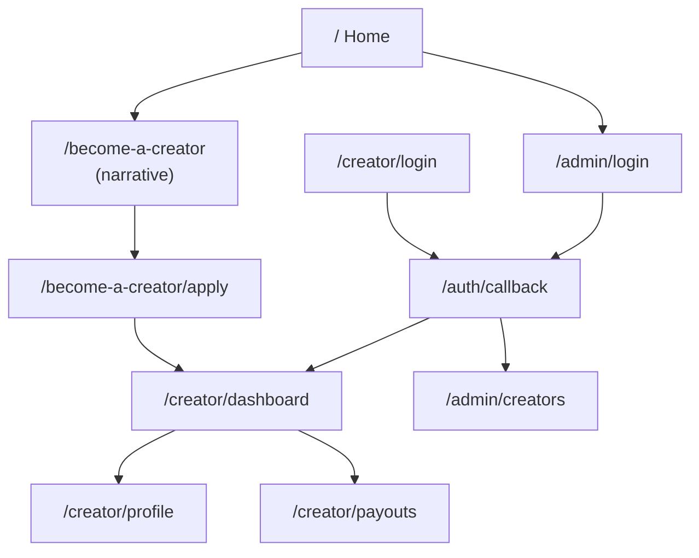

# Sitemap

Every route in the app. Nothing under `/admin` is linked from anywhere except the home menu.

```
/                                Home, coming soon                   public

/become-a-creator                Pre-application narrative           public
/become-a-creator/apply          Application, five steps             public

/creator
├── /login                       Creator login, magic link           public
├── /dashboard                   Status, or the waiting stage        creator
├── /profile                     Profile editor                      creator, approved only
└── /payouts                     Bank or UPI, and PAN                creator, approved only

/admin
├── /login                       Admin login, magic link             public
└── /creators                    Creator approvals                   admin

/auth/callback                   Magic link lands here               public
```

Ten routes. Brands do not hold accounts and have no surface in this product: BCM owns the creator roster and brings creators work outside the app.

## Structure diagram



## Who can reach what

- **Home header**: logo left, hamburger right at every breakpoint. Two items: Become a creator, Admin login.
- **Creator sidebar** (`CreatorShell`): Overview, Profile, Payout details.
- **Admin sidebar** (`AdminShell`): Creator approvals. Admin does one thing here, approve and reject, and is not expanded further in this repo.

## How access is actually enforced

Three layers, only one of which is the security boundary:

1. **Row Level Security in Postgres.** The real boundary. A creator's query returns only their own row because the database refuses the rest. See `supabase/migrations/0001_init.sql`.
2. **Server Component redirects.** `/creator/profile` and `/creator/payouts` send anyone not yet approved back to the dashboard; `/admin/creators` sends a non-admin home.
3. **Middleware.** Refreshes the session and bounces anonymous traffic to the right login. Convenience, not protection.

Route constants live in [`lib/routes.ts`](./lib/routes.ts), which this file is kept in sync with by hand.
