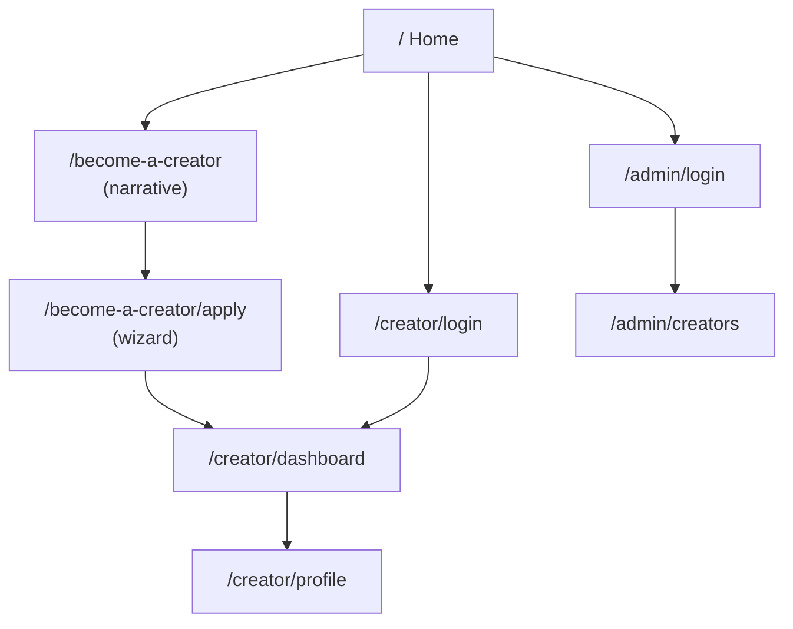

# Sitemap

Every route in the app. "Auth" = requires a logged-in session for that role (`RequireAuth`, redirects to that portal's own login if missing). Nothing under `/admin` is linked from anywhere else in the app.

```
/                                Home                                public

/become-a-creator                Pre-application narrative           public
/become-a-creator/apply          Application wizard                  public

/creator
├── /login                       Creator login                       public
├── /dashboard                   Overview + application status       creator
└── /profile                     Profile                             creator

/admin                           (never linked in any UI except the home menu)
├── /login                       Admin login                         public URL
└── /creators                    Creator approvals                   admin
```

Nine routes. Brands do not hold accounts and have no surface in this product: BCM owns the creator roster and brings creators work outside the app.

## Structure diagram



## Navigation reality — who can reach what

- **Home header**: logo left, hamburger right at every breakpoint. The menu holds two items: Become a creator, Admin login.
- **Creator portal sidebar** (`CreatorShell`): Overview, Profile.
- **Admin sidebar** (`AdminShell`): Creator approvals. Admin does one thing here, approve and reject. It is not expanded further in this repo.

Full route constants live in [`lib/routes.ts`](./lib/routes.ts) — that file is the single source of truth this sitemap is kept in sync with by hand.
