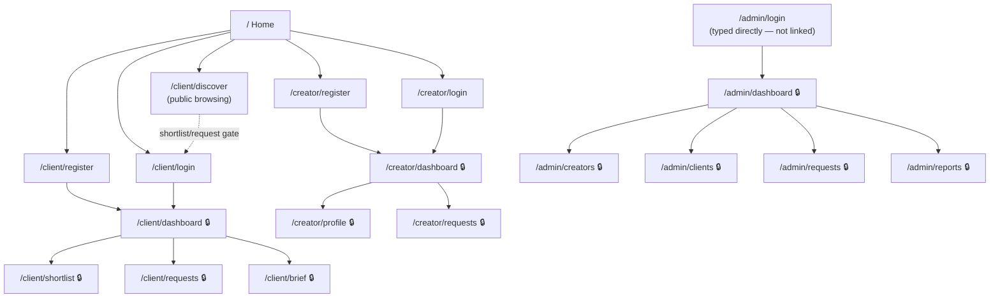

# Sitemap

Every route in the app, grouped by surface. "Auth" = requires a logged-in session for that role (`RequireAuth`, redirects to that portal's own login if missing). Nothing under `/admin` is linked from anywhere else in the app — see PAGE_CONTENT_MAP.md.

```
/                               Home                              public

/client
├── /register                   Register your brand               public
├── /login                      Brand login                       public
├── /discover                   Browse creators                   public (shortlist/request actions gate into login)
├── /dashboard                  Overview                          🔒 client
├── /shortlist                  Shortlist                         🔒 client
├── /requests                   Requests                          🔒 client
└── /brief                      Post a brief                      🔒 client

/creator
├── /register                   Become a creator (wizard)          public
├── /login                      Creator login                     public
├── /dashboard                  Overview                          🔒 creator
├── /profile                    Profile & portfolio                🔒 creator
└── /requests                   Requests (inbox)                   🔒 creator

/admin                          (never linked in any UI — URL only)
├── /login                      Admin login                       public URL, not discoverable
├── /dashboard                  Overview                          🔒 admin
├── /creators                   Creator approvals                  🔒 admin
├── /clients                    Client approvals                   🔒 admin
├── /requests                   Requests / match tracking          🔒 admin
└── /reports                    Reports                            🔒 admin
```

## Structure diagram



## Navigation reality — who can reach what

- **Home header**: links to `/client/discover`, `/creator/register`, and a "Log in" menu with `/client/login` + `/creator/login`. If a session already exists (either role), it collapses to a single "Dashboard" button. Admin is never in this list.
- **Client portal sidebar** (`ClientShell`): Overview, Discover creators, Shortlist, Requests, Post a brief.
- **Creator portal sidebar** (`CreatorShell`): Overview, Profile & portfolio, Requests.
- **Admin sidebar** (`AdminShell`): Overview, Creator approvals, Client approvals, Requests, Reports.
- **`/admin/login`**: reachable only by typing the URL. No button, link, footer entry, or redirect anywhere in the codebase points to it.

Full route constants live in [`lib/routes.ts`](./lib/routes.ts) — that file is the single source of truth this sitemap is generated from by hand; keep them in sync when routes change.
